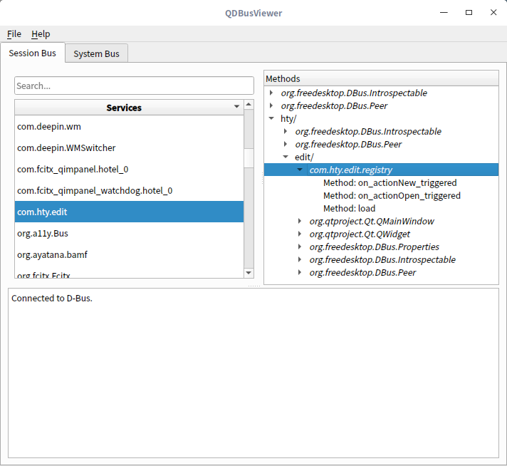

# QDBus 实现只运行一个程序并在新标签里打开文件
已编译好的 DBus 程序适用 64 位 Linux 系统 Qt5 环境，双击运行，其他版本请自行编译。  
  
### QDBus查看工具：qdbusviewer
  
### 参考：
https://blog.rekols.com/2018/09/29/dbus-basis/  
http://www.cnblogs.com/wwang/archive/2010/10/27/1862552.html